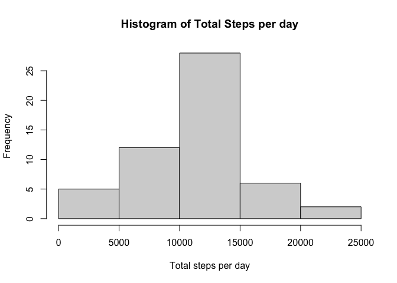
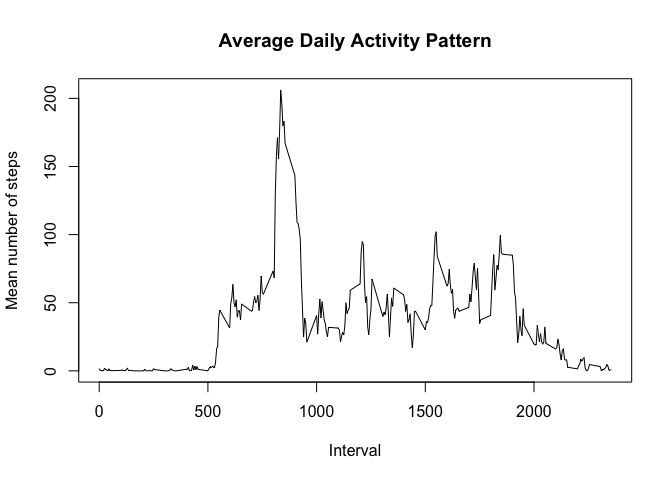
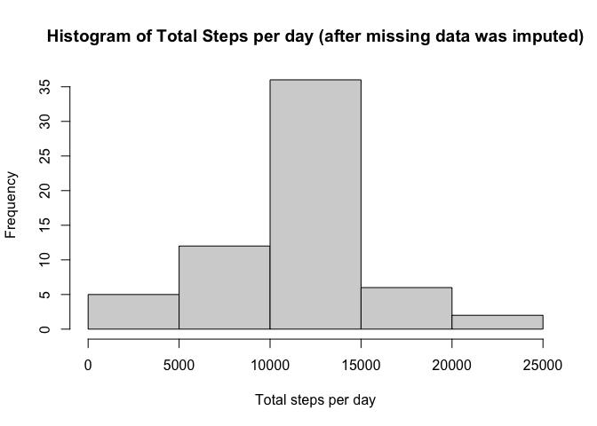
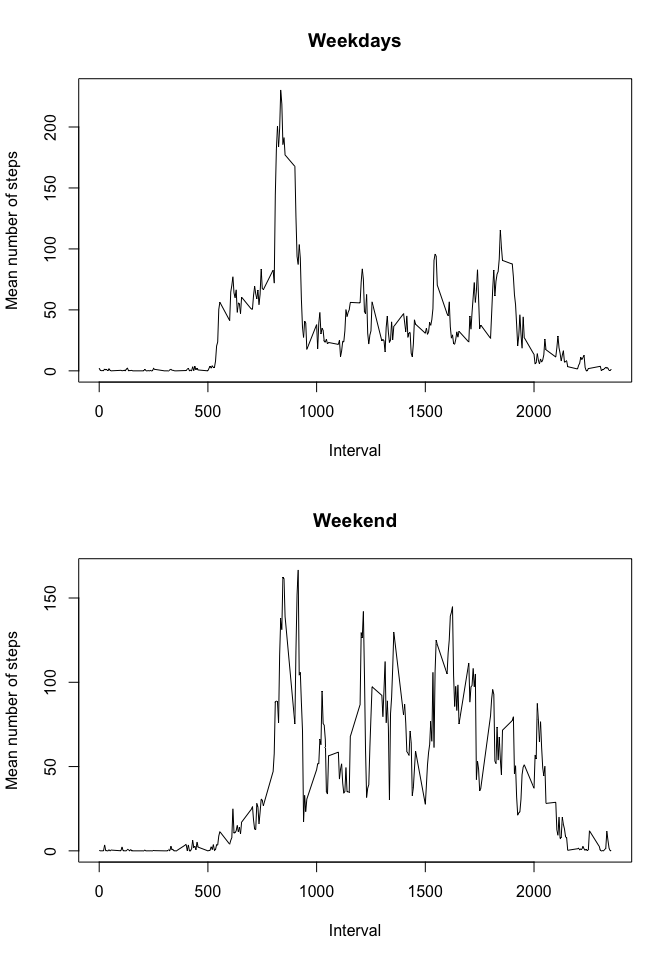

## Loading and preprocessing the data
For this project, the data was taken from the Reproducible Research course's Coursera web site. It was downloaded as a .zip file, which contained a .csv with the data. In order to load the data, the following code was used (assuming the .zip file was saved to the working directory).

```r
##unzip file
unzip("activity.zip")

##read csv
activity <- read.csv("activity.csv")
```

No additional processing was done to the data. It was used as it was received.

The structure of the data is as follows:

```r
head(activity)
```

```
##   steps       date interval
## 1    NA 2012-10-01        0
## 2    NA 2012-10-01        5
## 3    NA 2012-10-01       10
## 4    NA 2012-10-01       15
## 5    NA 2012-10-01       20
## 6    NA 2012-10-01       25
```

The first column (steps) contains the number of steps recorded in that 5 minute interval. 
The second column (date) indicates the day from which each observation was taken, and the third 
collumn (interval) brings the identification of the 5 minute interval.

## What is mean total number of steps taken per day?
To calculate what is the mean total steps taken per day, firstly the sum of steps per day was calculated, and stored in a variable "totalStepsDay".

```r
##total steps per day
totalStepsDay <- tapply(activity$steps, activity$date, sum, simplify = T)
totalStepsDay
```

```
## 2012-10-01 2012-10-02 2012-10-03 2012-10-04 2012-10-05 2012-10-06 2012-10-07 
##         NA        126      11352      12116      13294      15420      11015 
## 2012-10-08 2012-10-09 2012-10-10 2012-10-11 2012-10-12 2012-10-13 2012-10-14 
##         NA      12811       9900      10304      17382      12426      15098 
## 2012-10-15 2012-10-16 2012-10-17 2012-10-18 2012-10-19 2012-10-20 2012-10-21 
##      10139      15084      13452      10056      11829      10395       8821 
## 2012-10-22 2012-10-23 2012-10-24 2012-10-25 2012-10-26 2012-10-27 2012-10-28 
##      13460       8918       8355       2492       6778      10119      11458 
## 2012-10-29 2012-10-30 2012-10-31 2012-11-01 2012-11-02 2012-11-03 2012-11-04 
##       5018       9819      15414         NA      10600      10571         NA 
## 2012-11-05 2012-11-06 2012-11-07 2012-11-08 2012-11-09 2012-11-10 2012-11-11 
##      10439       8334      12883       3219         NA         NA      12608 
## 2012-11-12 2012-11-13 2012-11-14 2012-11-15 2012-11-16 2012-11-17 2012-11-18 
##      10765       7336         NA         41       5441      14339      15110 
## 2012-11-19 2012-11-20 2012-11-21 2012-11-22 2012-11-23 2012-11-24 2012-11-25 
##       8841       4472      12787      20427      21194      14478      11834 
## 2012-11-26 2012-11-27 2012-11-28 2012-11-29 2012-11-30 
##      11162      13646      10183       7047         NA
```

From this data, a histogram was created, showing the distribution of total steps per day.

```r
## makes histogram of data
hist(totalStepsDay, main = "Histogram of Total Steps per day", xlab = "Total steps per day")
```

<!-- -->

Finally the mean and median of the total steps per day were calculated:

```r
## calculates mean of data (makes sense based on histogram)
mean(totalStepsDay, na.rm = T)
```

```
## [1] 10766.19
```

```r
##calculates median of data
median(totalStepsDay, na.rm = T)
```

```
## [1] 10765
```


## What is the average daily activity pattern?
In order to calculate the average daily pattern, the average number of steps per interval was calculated (for each interval) using tapply(), and a plot was created showing the intervals in the x-axis and the average number of steps in each interval in the y-axis.

```r
##calculate mean steps per interval
meanStepsInterval <- tapply(activity$steps, activity$interval, mean, na.rm = T)
## make plot
plot(as.integer(levels(as.factor(activity$interval))), meanStepsInterval, 
     type = "l", main = "Average Daily Activity Pattern", xlab = "Interval", ylab = "Mean number of steps")
```

<!-- -->

In order to find the interval with the most average steps taken, the result of the tapply() was made a data frame, with the intervals in the first column and the mean steps in the second column. grep() was used to find the maximum value among the mean steps per interval values, and the value present in the first column (intervals) is shown below.

```r
##make data frame columns: interval, mean steps in interval, and get the row 
##that has the highest mean, take the interval info from there
data.frame(cbind(as.integer(levels(as.factor(activity$interval))), 
                 meanStepsInterval))[grep(max(meanStepsInterval), meanStepsInterval), 1]
```

```
## [1] 835
```

With this, we know that the interval with the highest mean steps is the interval 835.


## Imputing missing values
Reported in the table below is the number of rows that contain NA values in the "TRUE" column. 

```r
##imputing missing values
## total number of missing values in the data set
## table counts the number of rows that are not complete (have NA values) in TRUE 
## and complete cases in FALSE
table(!complete.cases(activity))
```

```
## 
## FALSE  TRUE 
## 15264  2304
```

With this we know that there are a total of 2304 rows with missing values.  
In order to deal with these, a choice was made to replace them with the mean number of steps corresponding to that particular 5 minute interval. A new data frame (filledActivity) was created equal to the original dataset, but with the missing data already replaced.

```r
## replace missing values: mean for that 5-min interval will be used, and create
## new data set with the missing data filled in
library(dplyr)
impute.mean <- function(x) replace(x, is.na(x), mean(x, na.rm = TRUE))
filledActivity <- activity %>%
  group_by(interval) %>%
  mutate(
    steps = impute.mean(steps)  
  )
```

Following the missing value imputation, the total number of steps per day was once again calculated, this time without any missing values.  
The following histogram shows the new distribution of total steps per day. The mean and median of the new dataset were also calculated.

```r
##total steps per day
filledTotalStepsDay <- tapply(filledActivity$steps, filledActivity$date, sum, simplify = T)
filledTotalStepsDay
```

```
## 2012-10-01 2012-10-02 2012-10-03 2012-10-04 2012-10-05 2012-10-06 2012-10-07 
##   10766.19     126.00   11352.00   12116.00   13294.00   15420.00   11015.00 
## 2012-10-08 2012-10-09 2012-10-10 2012-10-11 2012-10-12 2012-10-13 2012-10-14 
##   10766.19   12811.00    9900.00   10304.00   17382.00   12426.00   15098.00 
## 2012-10-15 2012-10-16 2012-10-17 2012-10-18 2012-10-19 2012-10-20 2012-10-21 
##   10139.00   15084.00   13452.00   10056.00   11829.00   10395.00    8821.00 
## 2012-10-22 2012-10-23 2012-10-24 2012-10-25 2012-10-26 2012-10-27 2012-10-28 
##   13460.00    8918.00    8355.00    2492.00    6778.00   10119.00   11458.00 
## 2012-10-29 2012-10-30 2012-10-31 2012-11-01 2012-11-02 2012-11-03 2012-11-04 
##    5018.00    9819.00   15414.00   10766.19   10600.00   10571.00   10766.19 
## 2012-11-05 2012-11-06 2012-11-07 2012-11-08 2012-11-09 2012-11-10 2012-11-11 
##   10439.00    8334.00   12883.00    3219.00   10766.19   10766.19   12608.00 
## 2012-11-12 2012-11-13 2012-11-14 2012-11-15 2012-11-16 2012-11-17 2012-11-18 
##   10765.00    7336.00   10766.19      41.00    5441.00   14339.00   15110.00 
## 2012-11-19 2012-11-20 2012-11-21 2012-11-22 2012-11-23 2012-11-24 2012-11-25 
##    8841.00    4472.00   12787.00   20427.00   21194.00   14478.00   11834.00 
## 2012-11-26 2012-11-27 2012-11-28 2012-11-29 2012-11-30 
##   11162.00   13646.00   10183.00    7047.00   10766.19
```

```r
## makes histogram of data
hist(filledTotalStepsDay, main = "Histogram of Total Steps per day (after missing data was imputed)", xlab = "Total steps per day")
```

<!-- -->

```r
## calculates mean of data (makes sense based on histogram)
mean(filledTotalStepsDay, na.rm = T)
```

```
## [1] 10766.19
```

```r
##calculates median of data
median(filledTotalStepsDay, na.rm = T)
```

```
## [1] 10766.19
```

As it can be noticed, the mean of the dataset with the imputed missing data (10766.19) is no different from the mean of the original dataset (10766.19). That can be explained by the fact that we used the mean of each interval, thus not changing the mean.  
However, the median of the dataset with the imputed missing data (10766.19) is different from the median of the original data (10765).

## Are there differences in activity patterns between weekdays and weekends?
To compare the average activity in weekends with the average activity in weekdays, a factor variable was added to the new dataset with two levels ("weekend", "weekday"), to indicate whether that particular observation was taken in a weekday or during the weekday.

```r
## make new column separating weekday and weekend
filledActivity$dayWeek <- as.factor(ifelse(weekdays(as.Date(filledActivity$date)) %in% c("Saturday", "Sunday"), "weekend", "weekday"))
```

Then, a new data frame was created with the mean steps per interval separated into 2 columns: weekends and weekday. The average activity for each was plotted in a line graph:

```r
## calculate mean per interval separated in weekday weekend
meanStepsIntervalWeek <- data.frame(tapply(filledActivity$steps, 
                            list(filledActivity$interval, filledActivity$dayWeek), mean, na.rm = T))
meanStepsIntervalWeek$interval <- row.names(meanStepsIntervalWeek)
## plot
par(mfrow = c(2,1))
plot(meanStepsIntervalWeek$interval, meanStepsIntervalWeek$weekday, 
     type = "l", xlab = "Interval", ylab = "Mean number of steps", main = "Weekdays")
plot(meanStepsIntervalWeek$interval, meanStepsIntervalWeek$weekend, 
     type = "l", xlab = "Interval", ylab = "Mean number of steps", main = "Weekend")
```

<!-- -->


It is possible to see the difference in mean activity. Where in the weekdays there is less activity around the middle of the day (possibly due to a day-time desk job), the weekends have periods with higher activity during that period.
